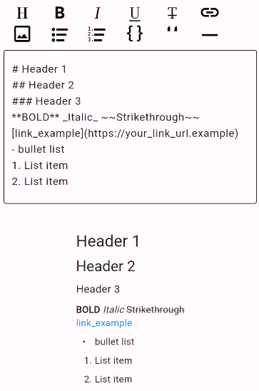

# Markdown Editor

A Markdown flexible editor designed for Flutter.

#### Markdown options

| Markdown          | Available |     |     |     |
| ----------------- | --------- | --- | --- | --- |
| # Header          | ❌        |     |     |     |
| **Bold**          | ✅        |     |     |     |
| _Italic_          | ✅        |     |     |     |
| ~~Strikethrough~~ | ✅        |     |     |     |
| Underline         | ✅        |     |     |     |
| • Bullet list     | ✅        |     |     |     |
| 1. Ordered list   | ✅        |     |     |     |
| [link_example]()  | ✅        |     |     |     |
| Image (network)   | ✅        |     |     |     |
| - [x] Checkbox    | ❌        |     |     |     |
| Code              | ❌        |     |     |     |
| Blockquote        | ✅        |     |     |     |
| Font family       | ❌        |     |     |     |
| Text color        | ❌        |     |     |     |

#### Platforms

| Platform | Status |     |     |     |
| -------- | ------ | --- | --- | --- |
| Windows  | ❌     |     |     |     |
| Linux    | ❌     |     |     |     |
| macOS    | ❌     |     |     |     |
| Android  | ✅     |     |     |     |
| iOS      | ✅     |     |     |     |
| Web      | ✅     |     |     |     |
